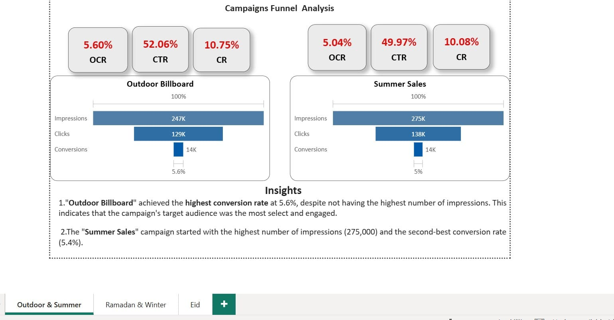
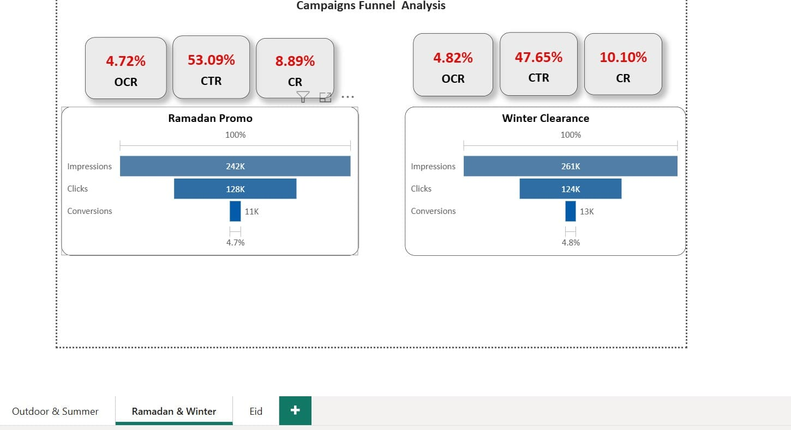
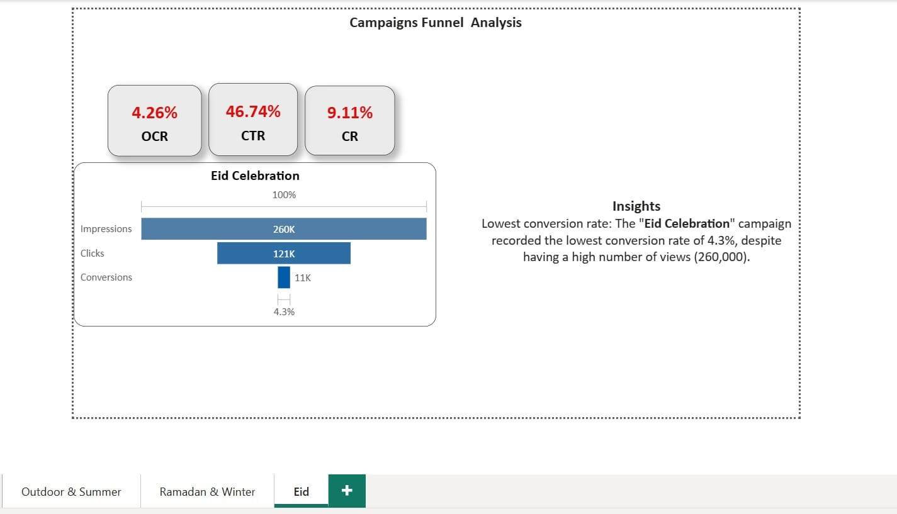
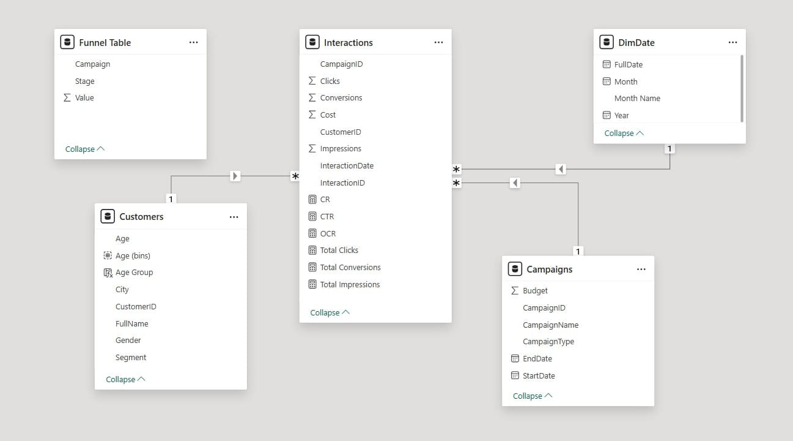

## 📊Power-Bi---Campaigns-Funnel-Analysis
 Funnel analysis of marketing campaign paths for only 3 stages
 
## 📌 Overview
This project provides a comprehensive analysis of the marketing funnel performance for five distinct campaigns: Outdoor Billboard, Summer Sales, Winter Clearance, Ramadan Promo, and Eid Celebration. The analysis tracks the customer journey from the initial Impressions stage, through Clicks, to the final Conversions, evaluating the ROI and efficiency of each marketing channel.

## ❓ Core Analytical Question
"Which marketing campaign demonstrated the highest efficiency in converting prospects into customers, and where do the primary drop-off points occur within the sales funnel for each campaign?"

## 🔍 Key Insights 
⚖️ Quality vs. QuantityEfficiency 
Winner: The Outdoor Billboard campaign achieved the highest conversion rate at 5.6%. Despite having fewer impressions than the Summer or Winter campaigns, it yielded the most "qualified"
traffic.
Volume Leader: 
The Summer Sales campaign generated the highest reach (275K Impressions) and clicks (138K), maintaining a strong 5.0% conversion rate.2. 
⚠️ Funnel Leakage & Drop-off AnalysisConversion Gap:
The Eid Celebration campaign showed the lowest efficiency (4.3%). Despite high initial awareness (260K Impressions), it struggled to close sales, suggesting a potential misalignment between the ad message and the landing page offer.

## 🛠 Tools & Skills

Power BI Desktop

Power Query

DAX (Measures & KPIs)

Data Modeling

## 📂 Dataset

Dim-Customers

Dim-Campaigns

Fact-Interactions

All data tables are included in the `Dataset` folder as an Excel file.

## 📷 Dashboard Preview

Here are screenshots of the dashboard:

## 📦 Full Project

The complete Power BI project file is available as:
`Customer_Behavior_Analysis.pbix`
